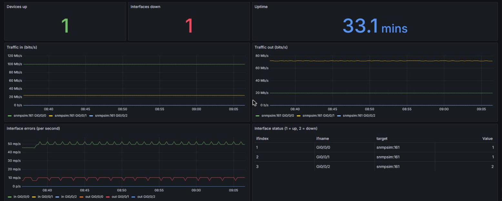

# snmp-exporter-go

A small SNMP exporter written in Go. It polls network devices (routers, switches, OLTs) over SNMP v2c and exposes interface metrics for Prometheus. The repo ships with a full demo stack: a simulated router, Prometheus with alert rules, and a ready-made Grafana dashboard.



## What it collects

| Metric | Source (MIB object) | Type |
| --- | --- | --- |
| `snmp_up` | poll result | gauge |
| `snmp_sys_uptime_seconds` | sysUpTime | gauge |
| `snmp_if_in_octets_total` / `snmp_if_out_octets_total` | ifHCInOctets / ifHCOutOctets (64-bit) | counter |
| `snmp_if_in_errors_total` / `snmp_if_out_errors_total` | ifInErrors / ifOutErrors | counter |
| `snmp_if_oper_status` | ifOperStatus (1 = up, 2 = down) | gauge |
| `snmp_scrape_duration_seconds` | poll time | gauge |

Interface metrics are labelled with `target`, `ifindex` and `ifname`. All targets are polled in parallel on each scrape. A device that does not answer shows up as `snmp_up 0` instead of breaking the scrape.

## Run the demo

Requires Docker.

```bash
docker compose up --build
```

| Service | URL |
| --- | --- |
| Grafana dashboard | http://localhost:3000 |
| Prometheus (and alerts) | http://localhost:9090/alerts |
| Raw metrics | http://localhost:9161/metrics |

The simulated router `edge-router-01` has three interfaces: two up with traffic and errors growing over time, and one down, so the dashboard and the `InterfaceDown` alert have something to show.

## Use it with real devices

```bash
go build -o snmp-exporter .
./snmp-exporter -targets 10.0.0.1,10.0.0.2:161 -community public -listen :9161
```

| Flag | Default | Meaning |
| --- | --- | --- |
| `-targets` | `127.0.0.1:161` | Comma-separated devices, `host` or `host:port` |
| `-community` | `public` | SNMP v2c community |
| `-listen` | `:9161` | Address for `/metrics` |
| `-timeout` | `3s` | Timeout per SNMP request |

Then point a Prometheus `scrape_configs` job at the exporter, as in `prometheus.yml`.

## Alerts included

- **DeviceUnreachable**: the device stopped answering SNMP for 2 minutes.
- **InterfaceDown**: an interface has been operationally down for 2 minutes.
- **InterfaceErrors**: an interface has logged errors for 5 minutes.

## Tests

```bash
go test ./...
```

## License

MIT
